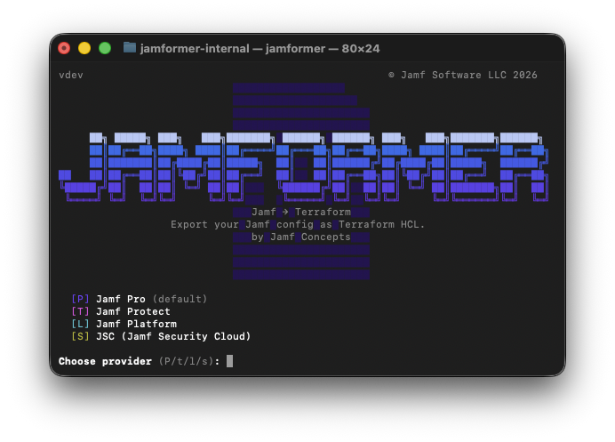

# jamformer

<p align="center">
  
</p>

> **Read this first.** jamformer is an **enablement, education, and acceleration tool** for teams adopting Jamf with Terraform. It is **not** a tool that produces production-ready Terraform code, and it is not a drop-in "export my Jamf instance to prod IaC" button.
>
> What it is good for:
>
> - Seeing what's actually in your Jamf instance, expressed in the Terraform providers' own resource model
> - Learning how each Jamf object maps to a Terraform resource — attributes, naming, cross-references, lifecycle quirks
> - Giving engineers and architects a realistic, resource-accurate starting point to refactor and harden into their own IaC
> - Bootstrapping proofs-of-concept, demos, workshops, and migration planning sessions
>
> What it is **not**:
>
> - A production code generator. The output will need human review, refactoring, secret handling, module extraction, naming conventions, and provider-drift fixes before it is safe to manage real infrastructure.
> - A substitute for learning Terraform or the Jamf providers. It accelerates the learning curve; it does not remove it.
>
> Treat every file it emits as a first draft.

A CLI tool that converts a Jamf instance into a structured Terraform project. It discovers resources via the Jamf API (or `terraform query` for Protect/Platform), generates Terraform import blocks, uses `terraform plan -generate-config-out` to produce HCL via the appropriate provider, then post-processes the output to add cross-resource references and organise resources into per-type files. The goal is to hand you a realistic scaffold to learn from and refine — not a finished product.

## Supported Providers

| Provider | Flag | Auth | Discovery Method |
|---|---|---|---|
| [jamfplatform](https://github.com/Jamf-Concepts/terraform-provider-jamfplatform) **(default)** | `-provider jamfplatform` | OAuth2 only | `terraform query` (Terraform 1.14+) |
| [jamfprotect](https://github.com/Jamf-Concepts/terraform-provider-jamfprotect) | `-provider jamfprotect` | OAuth2 only | `terraform query` (Terraform 1.14+) |
| [jsc](https://github.com/Jamf-Concepts/terraform-provider-jsctfprovider) | `-provider jsc` | Local account or Jamf ID | Terraform data sources |
| [jamfpro](https://github.com/deploymenttheory/terraform-provider-jamfpro) — community provider by Deployment Theory | `-provider jamfpro` | Basic auth or OAuth2 | Jamf Pro API via SDK |

> The `jamfplatform` provider now federates the full Jamf Pro surface (`jamfplatform_pro_*`) in addition to native Platform Services resources (blueprints, compliance benchmarks, device groups), and is the default. The `jamfpro` provider is the community-maintained provider by Deployment Theory and remains fully supported.

## Supported Resources

For the current authoritative list, run `./jamformer -list-resources` (optionally filter with `-provider`).

### Jamf Pro

Discoverable via the Jamf Pro API: Accounts, Account Groups, Advanced Computer Searches, Advanced Mobile Device Searches, Advanced User Searches, Allowed File Extensions, API Integrations, API Roles, App Installers, Buildings, Categories, Computer Extension Attributes, Computer Prestages, Departments, Device Enrollments (ADE), Disk Encryption Configurations, Dock Items, Enrollment Customizations, Icons, LDAP Servers, Mac Applications, macOS Configuration Profiles, Mobile Device Applications, Mobile Device Configuration Profiles, Mobile Device Extension Attributes, Mobile Device Prestages, Network Segments, Packages, Policies, Printers, Restricted Software, Scripts, Self Service Branding (iOS), Self Service Branding (macOS), Sites, Smart Computer Groups, Smart Mobile Device Groups, Static Computer Groups, Static Mobile Device Groups, User Groups, Volume Purchasing Locations (VPP), Webhooks.

Singleton settings imported with fixed IDs (no API discovery needed): Access Management, Account-Driven User Enrollment, Activation Code, App Installer Global Settings, Client Check-In, Cloud Distribution Point, Computer Inventory Collection, Device Communication, Engage, Impact Alert Notifications, Managed Software Update Feature Toggle, Re-enrollment, Self Service, Self Service+, Service Discovery Enrollment, SMTP Server.

### Jamf Protect

Action Configurations, Analytics, Jamf Managed Analytics, Analytic Sets, API Clients, Custom Prevent Lists, Exception Sets, Groups, Plans, Removable Storage Control Sets, Roles, Telemetry, Unified Logging Filters, Users, Change Management (singleton), Data Forwarding (singleton), Data Retention (singleton).

### Jamf Platform

Blueprints, Compliance Benchmarks, Device Groups.

### JSC - Jamf Security Cloud

Discoverable via Terraform data sources: Activation Profiles, Entra IdP Connections, Hostname Mappings, Access Policies.

Singleton: Secure Policy.

## Prerequisites

- [Go 1.26+](https://go.dev/dl/) (to build)
- **Jamf Pro:** A user account with read/auditor access, or an API integration with appropriate privileges
- **Jamf Protect / Platform:** An API client (OAuth2) with appropriate privileges. Requires Terraform 1.14+.
- **JSC:** A local account or Jamf ID with access to Jamf Security Cloud (radar.wandera.com). SSO/SAML accounts are not supported.

Terraform 1.15.x is automatically downloaded if not already installed (cached in a temp directory). Use `-terraform-path` to override with a pre-installed binary.

## Installation

```bash
git clone https://github.com/Jamf-Concepts/jamformer.git
cd jamformer
go build -o jamformer .
```

## Quick Start

```bash
# Jamf Pro with OAuth2
export JAMF_CLIENT_ID='your-client-id'
export JAMF_CLIENT_SECRET='your-client-secret'
./jamformer -url https://yourinstance.jamfcloud.com

# Jamf Pro with basic auth
export JAMF_USERNAME=admin
export JAMF_PASSWORD='yourpassword'
./jamformer -url https://yourinstance.jamfcloud.com

# Jamf Protect
export JAMF_CLIENT_ID='your-client-id'
export JAMF_CLIENT_SECRET='your-client-secret'
./jamformer -provider jamfprotect -url https://your-tenant.protect.jamfcloud.com

# Jamf Platform
export JAMF_CLIENT_ID='your-client-id'
export JAMF_CLIENT_SECRET='your-client-secret'
./jamformer -provider jamfplatform -url https://us.apigw.jamf.com

# JSC (Jamf Security Cloud)
export JAMF_USERNAME=your@email.com
export JAMF_PASSWORD='yourpassword'
./jamformer -provider jsc
```

Credentials are set via environment variables (`JAMF_USERNAME`, `JAMF_PASSWORD`, `JAMF_CLIENT_ID`, `JAMF_CLIENT_SECRET`) to avoid leaking secrets in shell history and process listings. Run without them for interactive prompts. The URL can be passed as a flag or via `JAMF_URL`. Shorthand URLs are supported (e.g. `yourinstance` expands to `yourinstance.jamfcloud.com`).

## Credentials

Credentials are sourced from environment variables or interactive prompts only (never CLI flags).

| Env Var | Description |
|---|---|
| `JAMF_USERNAME` | Jamf Pro / JSC username (basic auth) |
| `JAMF_PASSWORD` | Jamf Pro / JSC password (basic auth) |
| `JAMF_CLIENT_ID` | API client ID (OAuth2) |
| `JAMF_CLIENT_SECRET` | API client secret (OAuth2) |

### Jamf Pro API permissions

jamformer needs **Read** on every object type it is asked to discover. It performs no writes — generation is read-only against your instance.

- **Easiest setup:** assign the built-in `Auditor` user role (basic auth) or attach an `Auditor` privilege set to your API integration (OAuth2). `Auditor` grants read across Classic and Jamf Pro API objects, which covers the full range of resources jamformer supports.
- **Minimum-privilege setup:** if you prefer to scope the integration down, grant `Read` on each object type for every resource you intend to discover. The names in the Jamf Pro privilege UI map one-to-one to the Supported Resources list (for example, `Read Computers`, `Read Policies`, `Read Scripts`, `Read Mobile Device Configuration Profiles`, `Read LDAP Servers`, `Read Categories`, `Read Sites`, `Read Buildings`, `Read Departments`, `Read Network Segments`, `Read Printers`, `Read Dock Items`, `Read Packages`, `Read Smart Computer Groups`, `Read Static Computer Groups`, `Read Advanced Computer Searches`, `Read Mac Applications`, `Read Mobile Device Applications`, `Read Computer Prestage Enrollments`, `Read Mobile Device Prestage Enrollments`, `Read Device Enrollment Program Instances`, `Read Volume Purchasing Administrator Accounts`, `Read Volume Purchasing Locations`, `Read Restricted Software`, `Read Webhooks`, `Read User Accounts`, `Read Account Groups`, `Read Enrollment Customizations`, `Read Icon`, `Read JSS URL`, `Read SMTP Server`, `Read Activation Code`, `Read Engage Settings`, `Read Self Service Settings`, `Read Client Check-In Settings`, `Read Computer Inventory Collection Settings`, `Read Disk Encryption Configurations`, `Read Allowed File Extensions`, `Read Advanced User Content Searches`, `Read User Content Searches`, `Read Mobile Device Extension Attributes`, `Read Computer Extension Attributes`, `Read Managed Software Updates`). Exact privilege names can change across Jamf Pro versions — check the role editor in your instance if a privilege is not where this list suggests.
- **Singleton settings and many preference screens require additional `Read` privileges** beyond the core object types. If a resource comes back empty or a `terraform plan -generate-config-out` step reports "provider couldn't read resource," it is almost always a missing privilege on the integration or user.

**Jamf Protect, Jamf Platform, JSC:** create an API client (OAuth2 for Protect/Platform; local account or Jamf ID for JSC) with read access to every object surfaced in the relevant "Supported Resources" subsection above. Refer to each product's admin documentation for the specific role names, which change independently of jamformer.

## Flags

| Flag | Env Var | Description | Default |
|---|---|---|---|
| `-provider` | `JAMFORMER_PROVIDER` | Provider: `jamfplatform`, `jamfprotect`, `jsc`, or `jamfpro` | `jamfplatform` |
| `-url` | `JAMF_URL` | Jamf instance URL | |
| `-include-resources` | `JAMFORMER_RESOURCES` | Space-separated resource types to include | all |
| `-exclude-resources` | `JAMFORMER_EXCLUDE` | Space-separated resource types to exclude | |
| `-output` | `JAMFORMER_OUTPUT` | Output directory | `generated` |
| `-terraform-path` | `JAMFORMER_TERRAFORM_PATH` | Path to terraform binary (skip auto-download) | |
| `-skip-package-downloads` | `JAMFORMER_SKIP_PACKAGE_DOWNLOADS` | Skip downloading packages (Jamf Pro: CDP; Jamf Platform: JCDS) | `false` |
| `-skip-references` | `JAMFORMER_SKIP_REFERENCES` | Skip cross-resource reference resolution | `false` |
| `-skip-import-blocks` | `JAMFORMER_SKIP_IMPORT_BLOCKS` | Remove import blocks after generation | `false` |
| `-verbose` | `JAMFORMER_VERBOSE` | Show terraform command output | `false` |
| `-provider-version` | `JAMFORMER_PROVIDER_VERSION` | Pin a specific provider version (default: use latest, add `>=` constraint) | |
| `-allow-dev-overrides` | `JAMFORMER_ALLOW_DEV_OVERRIDES` | Allow Terraform provider `dev_overrides` from CLI config | `false` |
| `-compact` | `JAMFORMER_COMPACT` | Consolidate simple resource types into `for_each` patterns | `false` |
| `-compact-include` | `JAMFORMER_COMPACT_INCLUDE` | Space-separated resource types to compact (default: all eligible) | |
| `-compact-exclude` | `JAMFORMER_COMPACT_EXCLUDE` | Space-separated resource types to exclude from compaction | |
| `-skip-secret-scan` | `JAMFORMER_SKIP_SECRET_SCAN` | Skip secret scanning of generated output | `false` |
| `-multi-env` | `JAMFORMER_MULTI_ENV` | Space-separated environment names for multi-env export | |
| `-source-env` | `JAMFORMER_SOURCE_ENV` | Source-of-truth environment (default: first in list) | |
| `-list-resources` | | List valid resource filter names and exit | |
| `-version` / `-v` | | Print version and exit | |

## Filtering Resources

```bash
# Only discover specific types
./jamformer -include-resources "policies scripts categories"

# Exclude specific types
./jamformer -exclude-resources "packages icons"

# List available filter names
./jamformer -list-resources
```

When a referenced type isn't included, references remain as literal IDs rather than Terraform expressions.

## Compact Mode

The `-compact` flag consolidates simple, uniform resource types into `for_each` + `locals` patterns - producing output closer to what you'd write by hand in a production environment. Works across all providers.

```bash
# Compact all eligible types
./jamformer -compact

# Only compact specific types
./jamformer -compact -compact-include "categories departments"

# Compact everything except buildings
./jamformer -compact -compact-exclude "buildings"
```

**Before** (default output):

```hcl
resource "jamfpro_category" "productivity" {
  name = "Productivity"
}

resource "jamfpro_category" "security" {
  name = "Security"
}
```

**After** (`-compact`):

```hcl
locals {
  categories = {
    productivity = { name = "Productivity" }
    security     = { name = "Security" }
  }
}

resource "jamfpro_category" "all" {
  for_each = local.categories

  name = each.value.name
}
```

Eligibility is determined dynamically at runtime. A resource type qualifies when:

- The file contains 2+ resource blocks of a single type
- All blocks share the same set of attribute names
- No nested blocks (other than `lifecycle`) or nested attributes (structural types)
- At least one attribute varies across instances (otherwise they're duplicates)

Attributes that are identical across all instances become literals on the resource block; only varying values go in the locals map. Cross-resource references and import blocks are automatically rewritten to use the new addressing (e.g. `jamfpro_category.all["productivity"].id`).

The `-compact-include` and `-compact-exclude` flags accept the output filename stem (e.g. `categories`, `buildings`, `dock_items`) and can be space or comma separated.

## Output

The tool generates a self-contained Terraform project in the output directory:

- `provider.tf`, `variables.tf`, `terraform.tfvars` - provider configuration (credentials are not written to tfvars for security)
- Per-type resource files (e.g. `policies.tf`, `scripts.tf`)
- Per-type import block files (e.g. `policies_import.tf`, `scripts_import.tf`)
- `support_files/` - extracted scripts, configuration profiles, app configurations, packages, and branding images; `device_enrollment_tokens/` and `volume_purchasing_tokens/` directories are created as the recommended location for token files

Credentials are not written to `terraform.tfvars` for security. Supply them at plan/apply time via `TF_VAR_*` environment variables or Terraform's interactive prompt.

The generated `provider.tf` includes a minimum version constraint (`>= X.Y.Z`) based on the provider version that terraform downloaded. Use `-provider-version` to pin an exact version instead.

### OAuth2 Token Lifetime

When using OAuth2 authentication with Jamf Pro, jamformer probes the token endpoint to determine the access token's lifetime. If the token lifetime is shorter than the provider's default refresh buffer period (300 seconds) -common with API integrations configured for short-lived tokens -jamformer automatically sets `token_refresh_buffer_period_seconds` in the generated `provider.tf` to half the token lifetime (minimum 5 seconds). This prevents "token lifetime is shorter than buffer period" errors from the provider SDK during `terraform plan` and `terraform apply`.

## After Generation

```bash
cd generated
terraform plan     # Review the import plan, check for provider errors
terraform apply    # Import resources into state (see warning below)
rm *_import.tf     # Remove import blocks (no longer needed)
```

**Review carefully before running `terraform apply`.** The generated configuration may contain provider-level plan errors (cross-attribute validators, missing blocks, etc.) that need manual fixing first. Always inspect the plan output and resolve any errors before applying. Remember: this tool gives you a starting point, not a finished product.

## Multi-Environment Support

> **⚠️ Experimental and highly advanced.** This feature is intended for people who are already comfortable with Terraform modules, long-lived branch workflows, and the Jamf provider's resource model. It produces output that is *more* of a scaffold than the single-environment mode, not less — expect to edit the generated module, the per-env roots, and the variables extraction before any of it is usable. Treat it as a research/enablement feature, not a supported production workflow.

For teams managing multiple Jamf Pro environments (dev, staging, prod), jamformer can generate a Terraform project structured for a long-lived branch workflow. The output uses a shared module with per-environment root directories, designed for git branching strategies where each branch represents an environment (e.g. staging -> main promotion).

**Prerequisites:** Your environments should have matching resource names where possible. Resources are matched across environments by name - duplicate names within a resource type may cause incorrect matching. This feature is designed for environments that are intentionally kept in sync.

### Setup

Set per-environment credentials using environment variables with an environment name suffix:

```bash
export JAMF_URL_STAGING=https://staging.jamfcloud.com
export JAMF_CLIENT_ID_STAGING=xxx
export JAMF_CLIENT_SECRET_STAGING=xxx

export JAMF_URL_PROD=https://prod.jamfcloud.com
export JAMF_CLIENT_ID_PROD=xxx
export JAMF_CLIENT_SECRET_PROD=xxx

./jamformer -multi-env "staging prod"
```

The first environment listed is the source of truth for resource definitions. Use `-source-env` to override this.

### Output Structure

```
generated/
  modules/jamf/              # shared resource definitions
    policies.tf              # resources in ALL environments
    scripts.tf
    policies_staging_only.tf # resources only in staging (delete on prod branch)
    variables.tf             # module input variables
    support_files/           # files identical across environments
      scripts/
      macos_configuration_profiles/
  environments/
    staging/
      main.tf                # provider config + module call
      backend.tf             # placeholder - configure your state backend
      variables.tf           # auth + pass-through variables
      terraform.tfvars       # environment-specific values
      imports.tf             # import blocks with module.jamf. prefix
    prod/
      main.tf
      backend.tf
      variables.tf
      terraform.tfvars
      imports.tf
```

### How It Works

1. Runs discovery and `terraform plan` against each environment independently
2. Matches resources across environments by name
3. Generates a module + environment directory structure:
   - `modules/jamf/` - shared resource definitions with `var.xxx` for differing attributes
   - Resources only in some environments are separated into `*_<env>_only.tf` files
   - Support files identical across environments go in the module; divergent files go per-env
   - Each `environments/<env>/` has its own provider config, backend, variables, tfvars, and imports
   - Import blocks use `module.jamf.<type>.<label>` addressing

### Branch Workflow

1. Commit the output to a repo and create a long-lived branch per environment (e.g. `staging`, `main` for prod)
2. On each branch, configure `backend.tf` with your state backend
3. On each branch, delete `*_<other_env>_only.tf` files from the module (e.g. on `main`, delete `*_staging_only.tf`)
4. Set up branch protection: `main` only accepts merges from `staging`
5. Configure CI to run `terraform apply` in `environments/<env>/` when code lands on the corresponding branch
6. Run initial import per environment: `cd environments/<env> && terraform init && terraform apply`

Feature branches are created from `staging`, merged to `staging` via PR, then promoted to `main` via PR. The shared module merges cleanly because it's identical across branches.

### Limitations

- Only supports the Jamf Pro provider (Protect/Platform coming later)
- Cannot be combined with `-compact` mode
- Resources matched by name - duplicate names within a resource type may cause incorrect cross-env matching
- Requires at least 2 environments

## What the Tool Does

1. **Discovers** resources from the Jamf API (or via `terraform query` for Protect/Platform)
2. **Generates** Terraform import blocks with sanitised resource labels
3. **Runs** `terraform plan -generate-config-out` to produce HCL from the provider
4. **Post-processes** the output:
   - Rewrites literal Jamf IDs to cross-resource Terraform references
   - Extracts embedded content (scripts, profiles) to individual files with `file()` references
   - Generates `file(var.xxx)` path variables for DEP/VPP tokens (download from Apple Business/School Manager)
   - Resolves icon CDN URLs (no local downloads) with `lifecycle { ignore_changes }` to prevent destroy/create on first apply
   - Downloads binary assets (packages, branding images)
   - Strips null optional attributes and removes values that cause drift (e.g. `category_id = -1`)
   - Splits the monolithic generated file into per-resource-type files
5. **Validates** the output and auto-fixes schema-level errors (see [Validation Auto-Fix](#validation-auto-fix) below)
6. **Scans** for secrets using gitleaks with Jamf-specific rules (passwords in HCL, plist XML secrets, LDAP/SMTP/WiFi credentials) and offers to move them to sensitive Terraform variables

### Validation Auto-Fix

After splitting the generated HCL into per-type files, jamformer runs `terraform validate` in a loop and auto-fixes errors using the following strategies:

| Error Pattern | Fix Strategy |
| --- | --- |
| "Attribute X ... Remove it" | Remove the attribute |
| "'attr' must be 'VALUE' when ..." | Set the attribute to the required value |
| "must be one of [A B], got: X" | Remove the attribute with the invalid value |
| "conflicts with other_attr" | Remove the conflicting attribute |
| Required attribute is `null` (sensitive) | Replace with a Terraform variable reference (`var.X`) |
| Required attribute is `null` (non-sensitive) | Replace with the type-appropriate zero value (`""`, `false`, `0`) |

**Sensitive variables:** Terraform does not include sensitive attribute values in generated configuration -any attribute marked `sensitive` in the provider schema is written as `null` in the generated HCL, regardless of whether the API returned a value. This includes both truly write-only fields (e.g. passwords that the API never returns) and fields the API does return but the provider marks as sensitive (e.g. `admin_username` on computer prestages). Jamformer replaces these with uniquely-named Terraform variable references (e.g. `var.computer_prestage_enrollment_shared_admin_password`) and appends corresponding `variable` blocks to `variables.tf` with `sensitive = true`. You must supply real values for these variables via `TF_VAR_*` environment variables or `terraform.tfvars` at plan/apply time.

**Non-sensitive required nulls:** Some required attributes are returned as `null` by the API import but aren't marked sensitive. These are replaced with the appropriate zero value for their type (empty string for strings, `false` for bools, `0` for numbers) based on the provider schema. This is a safe default that satisfies the schema requirement without creating unnecessary variables.

## Secret Scanning

After generation, jamformer scans the output directory for potential secrets using [gitleaks](https://github.com/gitleaks/gitleaks) (MIT licensed) with additional Jamf-specific detection rules:

- **HCL attributes** -`password`, `secret`, `credential` values in `.tf` files
- **Plist/XML** -`<key>Password</key><string>...</string>` patterns in app configurations and profiles, including multiline XML where the key and value are on separate lines
- **Infrastructure credentials** -LDAP bind passwords, SMTP passwords, WiFi/VPN shared secrets
- **Standard patterns** -Private keys, API tokens, cloud credentials (200+ default gitleaks rules)

When secrets are detected, the report shows the exact resource, attribute, and redacted value. In interactive mode, you choose how to proceed:

- **`[a]ll`** - remediate all findings automatically
- **`[s]elect individually`** - walk through each finding and choose `[y/N]`
- **`[N]one`** - skip remediation entirely

Remediation moves secrets to sensitive Terraform variables:

- **For `.tf` files:** if the secret is the entire attribute value, the literal is replaced with `var.<name>`. If the secret is embedded in a larger string (e.g. `parameter8 = "enrollauthtoken=SECRET"`), HCL string interpolation is used instead: `"enrollauthtoken=${var.name}"`. Secrets that can't be replaced are skipped with a warning.
- **For `support_files/`:** the file is converted to a `.tpl` template, existing `${}` expressions are escaped as `$${}`, and the secret is replaced with a template variable. The `.tf` reference changes from `file()` to `templatefile()`. When multiple secrets exist in the same support file, subsequent findings update the `.tpl` in place and add their variable to the existing `templatefile()` variable map.

After remediation, `terraform fmt` runs automatically for consistent formatting. Provider credential variables (`client_id`, `client_secret`, `password`) are also marked `sensitive = true` in the generated `variables.tf`.

Use `-skip-secret-scan` to disable scanning.

## CI / Non-Interactive Usage

jamformer detects non-interactive environments and fails fast if credentials are missing.

```yaml
- name: Generate Terraform from Jamf Pro
  env:
    JAMF_URL: ${{ secrets.JAMF_URL }}
    JAMF_CLIENT_ID: ${{ secrets.JAMF_CLIENT_ID }}
    JAMF_CLIENT_SECRET: ${{ secrets.JAMF_CLIENT_SECRET }}
  run: ./jamformer -skip-package-downloads
```

## Troubleshooting

jamformer does not write persistent log files. All output goes to stdout/stderr. For deeper diagnostics, re-run with `-verbose` to surface the full `terraform` command output instead of the spinner summary.

### Authentication failed

Verified at startup before any terraform step runs, so this fails fast.

- Confirm the right environment variables are set for the auth method you intend to use. Basic auth needs `JAMF_USERNAME` and `JAMF_PASSWORD`. OAuth2 needs `JAMF_CLIENT_ID` and `JAMF_CLIENT_SECRET`. Setting credentials for both at once is rejected.
- Jamf Protect and Jamf Platform accept OAuth2 only; JSC accepts basic auth only. The tool prints a clear error if you mix them with the wrong provider.
- For OAuth2, the integration must have an active privilege set / role. A client with no privileges will authenticate successfully but fail on the first real call — check the "Jamf Pro API permissions" section above.
- If the URL is wrong (typo, missing region, or mismatched Protect tenant), you will usually see a network or TLS error rather than an auth error. Double-check it and try again.

### "Provider couldn't read resource" during `terraform plan -generate-config-out`

The pipeline already handles this automatically: when the provider refuses to read a specific resource, the offending `import {}` block is removed and the step is retried until `terraform plan` succeeds or there is nothing left to retry. Re-run with `-verbose` to see which addresses were dropped.

The most common root cause is missing privileges on the Jamf Pro integration. If a whole resource type is silently absent from the generated output, confirm the integration has `Read` on that object type. If only some resources are dropped, the usual culprit is a provider bug with a specific attribute on that resource — file an issue (see Support below) with the `-verbose` output and the resource address.

### Token refresh errors / short-lived OAuth2 tokens

The tool probes `/api/oauth/token` at startup to determine your integration's `expires_in`, then sets `TokenRefreshBufferPeriod` to roughly half the lifetime and writes `token_refresh_buffer_period_seconds` into the generated `provider.tf`.

If you rotate or replace the API integration after generation and the new token lifetime differs from the old one, edit `token_refresh_buffer_period_seconds` in `provider.tf` (set it to roughly half of the new `expires_in`). If you remove the attribute entirely, the provider falls back to its own default (300s), which may be longer than the new token's lifetime and cause auth failures during apply.

### Spinner shows nothing for a long time

Resource listings for very large instances (thousands of policies / icons / profiles) can take minutes. `-verbose` shows the underlying `terraform` commands so you can see progress. `-parallelism N` increases concurrent provider reads during generation.

### `terraform query` / Terraform 1.14 errors (Protect, Platform)

Protect and Platform use `terraform query`, which requires Terraform 1.14 or later. jamformer auto-downloads a compatible version. If you pinned a pre-1.14 binary with `-terraform-path`, remove the flag or upgrade the pinned binary.

## Support

- **Issues and feature requests:** [https://github.com/Jamf-Concepts/jamformer/issues](https://github.com/Jamf-Concepts/jamformer/issues). Include the provider, the command you ran (redacted), the `-verbose` output, and the jamformer version (`jamformer -version`).
- **Questions and discussion:** `#jamformer` on the [MacAdmins Slack](https://macadmins.org/).

## Known Limitations

- **Not production-ready output** - The generated HCL is a starting point that will likely need review and refinement before managing real infrastructure.
- **Provider drift** - Some attributes may show as changes on `terraform plan` after import due to provider SDK defaults that don't round-trip. These are provider issues, not jamformer issues.
- **Icon discovery** - Icons are discovered by scanning policies, profiles, and apps individually (no "list all icons" API). This adds API calls proportional to the number of policies + profiles + apps. Icons are referenced via CDN URL (`icon_file_web_source`) rather than downloaded locally, and include `lifecycle { ignore_changes }` to prevent destroy/create on first apply. Icon resource labels match the referencing resource (e.g. `jamfpro_icon.install_chrome` for `jamfpro_policy.install_chrome`).
- **Package downloads** - For Jamf Pro, packages are downloaded from the Cloud Distribution Point by default. For Jamf Platform, packages resident in the Jamf Cloud Distribution Service (JCDS) are downloaded by default when `JAMF_TENANT_ID` is set (JCDS is tenant-scoped); catalog packages whose bytes live elsewhere are kept as metadata + server-supplied hashes. Use `-skip-package-downloads` to skip in both cases.
- **Blueprint drafts (Jamf Platform)** - A blueprint with no device groups is a non-creatable UI draft (`POST /blueprints` rejects an empty scope). jamformer skips these on export with a warning, since they would otherwise fail `terraform validate`.
- **Terraform 1.14+** - Jamf Protect and Platform require Terraform 1.14+ for `terraform query` support.
- **OAuth2 short-lived tokens** - API integrations with very short token lifetimes (under 60 seconds) are supported via automatic token lifetime probing. The generated `provider.tf` includes `token_refresh_buffer_period_seconds` when needed. If you change API integrations after generation, you may need to update this value.
- **JSC auth** - JSC requires a local account or Jamf ID. SSO/SAML authentication is not supported.
